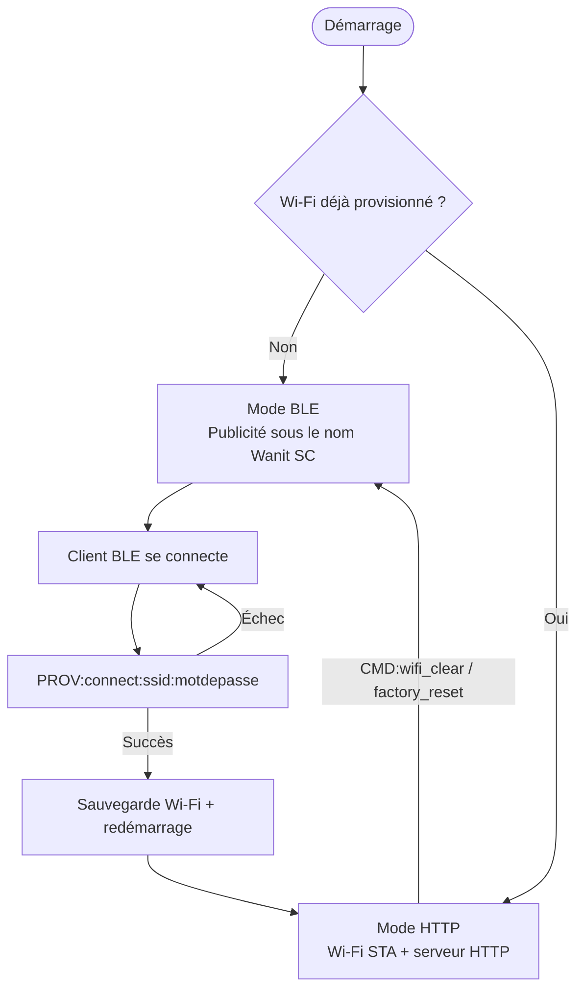

# Wanit Gateway


Firmware compilé pour le **Wanit Gateway**, un pont ESP32-C6 entre BLE/Wi-Fi et UART. Il permet de provisionner l'appareil en Wi-Fi via BLE, puis d'échanger des données avec un microcontrôleur (ex. STM32) via HTTP, y compris pour des mises à jour firmware en pass-through binaire.

> Ce dépôt ne contient **que les binaires compilés et la documentation** de chaque version. Le code source du firmware n'est pas public pour le moment.

---

## Fonctionnalités

- **Provisioning BLE** (service Nordic UART) : scan et connexion Wi-Fi via commandes `PROV:`, sans écran ni clavier sur l'appareil.
- **Bascule automatique BLE → HTTP** une fois le Wi-Fi provisionné, avec reconnexion automatique en cas de coupure.
- **Pont UART sur HTTP** : envoi/réception de trames vers le microcontrôleur connecté, avec découverte réseau via mDNS.
- **Canal brut (raw) pour mises à jour STM32** : transfert binaire transparent UART ↔ HTTP/BLE, pour piloter un bootloader STM32 directement depuis une application cliente.
- **Authentification HTTP optionnelle** par jeton (`X-Auth-Token`).

Le détail complet du protocole (commandes, formats de trame, machine d'état) est fourni dans la documentation jointe à chaque release.

### Cycle de vie de l'appareil



---

## Télécharger

Toutes les versions sont disponibles dans l'onglet [**Releases**](https://github.com/Math0XK/wanit-gateway-releases/releases). Chaque release contient :

| Fichier | Description |
|---|---|
| `esp32-ble-wifi-uart-bridge-full.bin` | Image complète (bootloader + partitions + firmware), à flasher en une seule commande |
| `firmware.bin` | Application seule |
| `bootloader.bin` | Bootloader ESP-IDF |
| `partitions.bin` | Table de partitions |
| `README.md` | Manifeste du protocole (référence complète pour l'intégration) |
| `INTEGRATION_GUIDE_FR.md` / `INTEGRATION_GUIDE_EN.md` | Guides d'intégration côté application cliente |
| `PATCH_NOTES_*.md` | Notes de version |

---

## Flasher le firmware

### Prérequis

```
pip install esptool
```

### Option A — image complète (recommandé)

Un seul fichier, une seule commande :

```
python -m esptool --chip esp32c6 --port <PORT> --baud 921600 write-flash 0x0 "<chemin d'accès>\esp32-ble-wifi-uart-bridge-full.bin"
```

Remplace `<PORT>` par le port série de l'appareil (ex. `COM5` sur Windows, `/dev/ttyUSB0` sur Linux/macOS).

### Option B — images séparées

```
esptool.py --chip esp32c6 --port <PORT> --baud 921600 write_flash \
  0x0     bootloader.bin \
  0x8000  partitions.bin \
  0x10000 firmware.bin
```

> Les offsets ci-dessus sont ceux par défaut pour l'ESP32-C6. Vérifiez-les dans les logs de build de la release concernée.

Après le flash, l'appareil redémarre en mode BLE (publicité sous le nom `Wanit SC`) s'il n'a pas encore été provisionné.

---

## Documentation

- **Manifeste du protocole** (BLE, HTTP, formats de trame, machine d'état) — fourni en pièce jointe de chaque release (`README.md`)
- **Guides d'intégration** FR/EN — pour les développeurs d'applications clientes
- **Notes de version** — changements et compatibilité entre versions

---

## Licence

Les binaires et la documentation publiés dans ce dépôt sont distribués sous licence **MIT** (voir [`LICENSE`](LICENSE)).

Cette licence couvre uniquement les artefacts publiés ici (binaires compilés et documentation). Le code source du firmware reste la propriété de Wanit et n'est pas couvert par cette licence.
